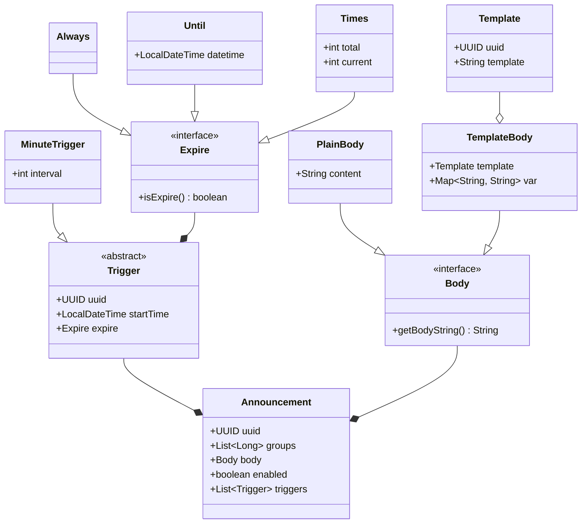
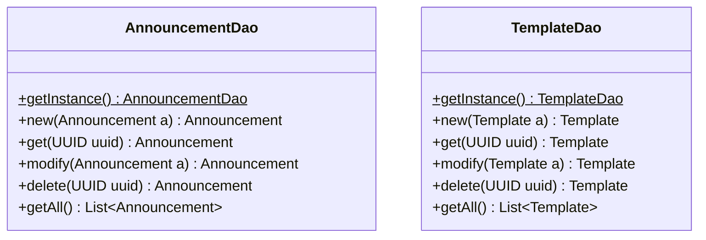
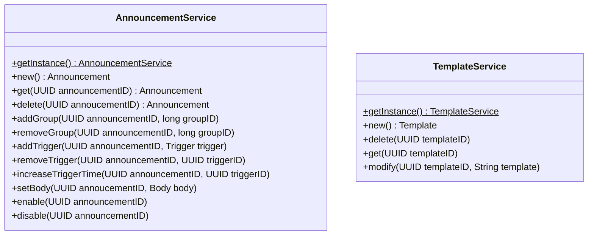

# 类图
## 实体类

```mermaid
classDiagram
class Body {
    <<interface>>    
    +getBodyString() String
}
class PlainBody {
    +String content
}
PlainBody --|> Body
class Template {
    +UUID uuid
    +String template
}
class TemplateBody {
    +Template template
    +Map~String, String~ var
}
Template --o TemplateBody
TemplateBody --|> Body
class Expire {
    <<interface>>
    +isExpire() boolean
}
class Always {
    
}
Always --|> Expire
class Until {
    +LocalDateTime datetime
}
Until --|> Expire
class Times {
    +int total
    +int current
}
Times --|> Expire
class Trigger {
    <<abstract>>
    +UUID uuid
    +LocalDateTime startTime
    +Expire expire
}
class MinuteTrigger {
    +int interval
}
MinuteTrigger --|> Trigger
Expire --* Trigger
class Announcement {
    +UUID uuid
    +List~Long~ groups
    +Body body
    +boolean enabled
    +List~Trigger~ triggers
}
Trigger --* Announcement
Body --* Announcement
```

## Dao

```mermaid
classDiagram
class AnnouncementDao {
    +getInstance()$ AnnouncementDao
    
    +new(Announcement a) Announcement
    +get(UUID uuid) Announcement
    +modify(Announcement a) Announcement
    +delete(UUID uuid) Announcement 
    +getAll() List~Announcement~
}
class TemplateDao {
    +getInstance()$ TemplateDao
    
    +new(Template a) Template
    +get(UUID uuid) Template
    +modify(Template a) Template
    +delete(UUID uuid) Template
    +getAll() List~Template~
}
```

## Service

```mermaid
classDiagram
class AnnouncementService {
    +getInstance()$ AnnouncementService
    
    +new() Announcement
    +get(UUID announcementID) Announcement
    +delete(UUID annoucementID) Announcement
    +addGroup(UUID announcementID, long groupID)
    +removeGroup(UUID announcementID, long groupID)
    +addTrigger(UUID announcementID, Trigger trigger)
    +removeTrigger(UUID announcementID, UUID triggerID)
    +increaseTriggerTime(UUID announcementID, UUID triggerID)
    +setBody(UUID annoucementID, Body body)
    +enable(UUID announcementID)
    +disable(UUID announcementID)
}
class TemplateService {
    +getInstance()$ TemplateService
    
    +new() Template
    +delete(UUID templateID)
    +get(UUID templateID)
    +modify(UUID templateID, String template)
}
```