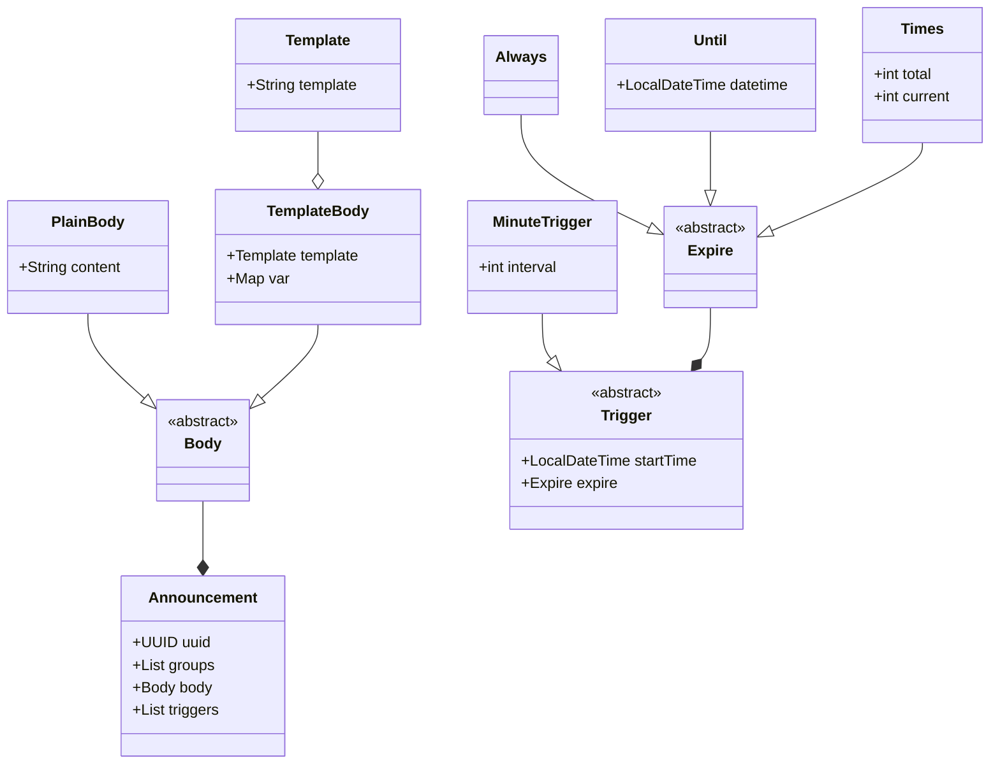

# 类图
## 实体类

```mermaid
classDiagram
class Body {
    <<abstract>>    
}
class PlainBody {
    +String content
}
PlainBody --|> Body
class Template {
    +String template
}
class TemplateBody {
    +Template template
    +Map<String, String> var
}
Template --o TemplateBody
TemplateBody --|> Body
class Expire {
    <<abstract>>
}
class Always {
    
}
Always --|> Expire
class Until {
    +LocalDateTime datetime
}
Until --|> Expire
class Times {
    +int total
    +int current
}
Times --|> Expire
class Trigger {
    <<abstract>>
    +LocalDateTime startTime
    +Expire expire
}
class MinuteTrigger {
    +int interval
}
MinuteTrigger --|> Trigger
Expire --* Trigger
class Announcement {
    +UUID uuid
    +List<Long> groups
    +Body body
    +List<Trigger> triggers
}
Body --* Announcement
```