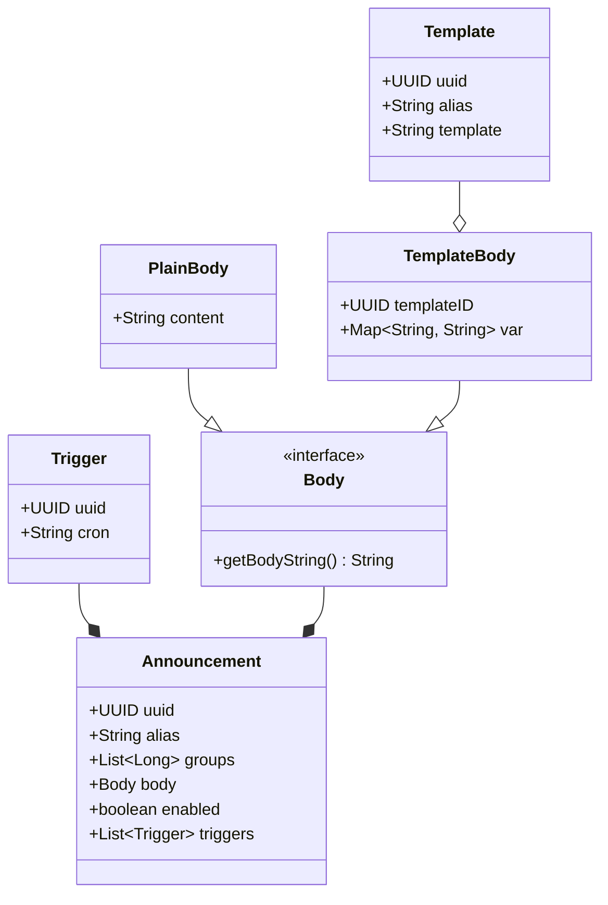
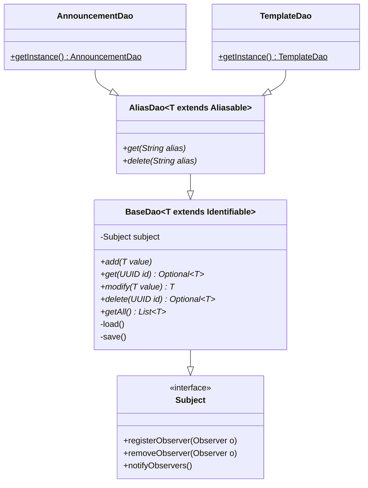
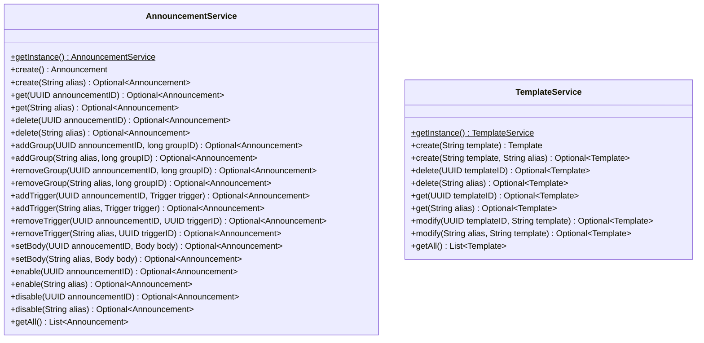

# 类图
## 实体类

```mermaid
classDiagram
class Body {
    <<interface>>    
    +getBodyString() String
}
class PlainBody {
    +String content
}
PlainBody --|> Body
class Template {
    +UUID uuid
    +String alias                                                                                                           
    +String template
}
class TemplateBody {
    +UUID templateID
    +Map~String, String~ var
}
Template --o TemplateBody
TemplateBody --|> Body
class Trigger {
    +UUID uuid
    +String cron
}
class Announcement {
    +UUID uuid
    +String alias
    +List~Long~ groups
    +Body body
    +boolean enabled
    +List~Trigger~ triggers
}
Trigger --* Announcement
Body --* Announcement
```

## Dao

```mermaid
classDiagram
class Subject {
    <<interface>>
    +registerObserver(Observer o)
    +removeObserver(Observer o)
    +notifyObservers()
}
class BaseDao~T extends Identifiable~ {
    +add(T value)*
    +get(UUID id)* Optional~T~
    +modify(T value)* T
    +delete(UUID id)* Optional~T~
    +getAll()* List~T~
    -load()
    -save()
    -Subject subject
}
BaseDao --|> Subject
class AliasDao~T extends Aliasable~ {
    +get(String alias)*
    +delete(String alias)*
}
AliasDao --|> BaseDao
class AnnouncementDao {
    +getInstance()$ AnnouncementDao
}
AnnouncementDao --|> AliasDao
class TemplateDao {
    +getInstance()$ TemplateDao
}
TemplateDao --|> AliasDao
```

## Service

```mermaid
classDiagram
class AnnouncementService {
    +getInstance()$ AnnouncementService
    
    +create() Announcement
    +create(String alias) Optional~Announcement~
    +get(UUID announcementID) Optional~Announcement~
    +get(String alias) Optional~Announcement~
    +delete(UUID annoucementID) Optional~Announcement~
    +delete(String alias) Optional~Announcement~
    +addGroup(UUID announcementID, long groupID) Optional~Announcement~
    +addGroup(String alias, long groupID) Optional~Announcement~
    +removeGroup(UUID announcementID, long groupID) Optional~Announcement~
    +removeGroup(String alias, long groupID) Optional~Announcement~
    +addTrigger(UUID announcementID, Trigger trigger) Optional~Announcement~
    +addTrigger(String alias, Trigger trigger) Optional~Announcement~
    +removeTrigger(UUID announcementID, UUID triggerID) Optional~Announcement~
    +removeTrigger(String alias, UUID triggerID) Optional~Announcement~
    +setBody(UUID annoucementID, Body body) Optional~Announcement~
    +setBody(String alias, Body body) Optional~Announcement~
    +enable(UUID announcementID) Optional~Announcement~
    +enable(String alias) Optional~Announcement~
    +disable(UUID announcementID) Optional~Announcement~
    +disable(String alias) Optional~Announcement~
    +getAll() List~Announcement~
}
class TemplateService {
    +getInstance()$ TemplateService
    
    +create(String template) Template
    +create(String template, String alias) Optional~Template~
    +delete(UUID templateID) Optional~Template~
    +delete(String alias) Optional~Template~
    +get(UUID templateID) Optional~Template~
    +get(String alias) Optional~Template~
    +modify(UUID templateID, String template) Optional~Template~
    +modify(String alias, String template) Optional~Template~
    +getAll() List~Template~
}
```