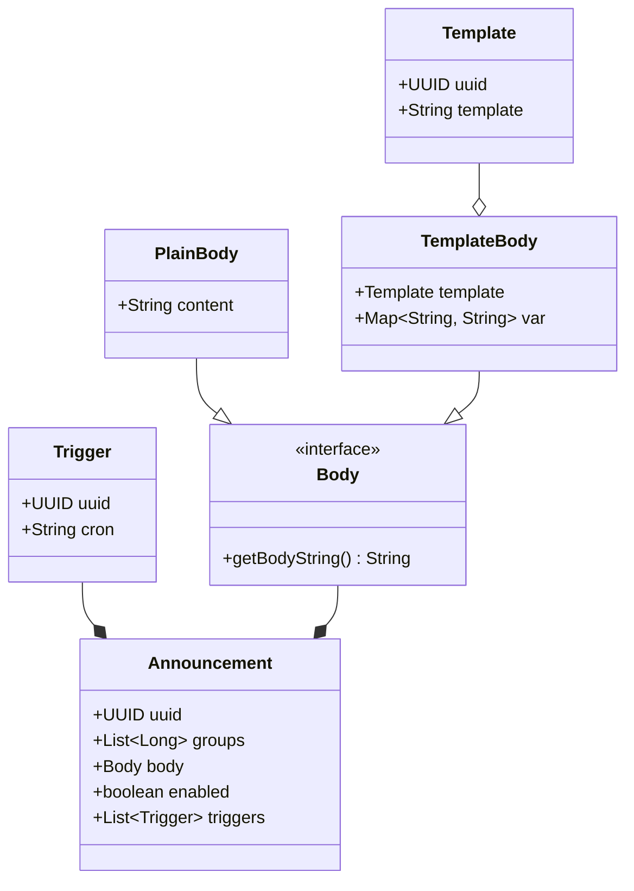
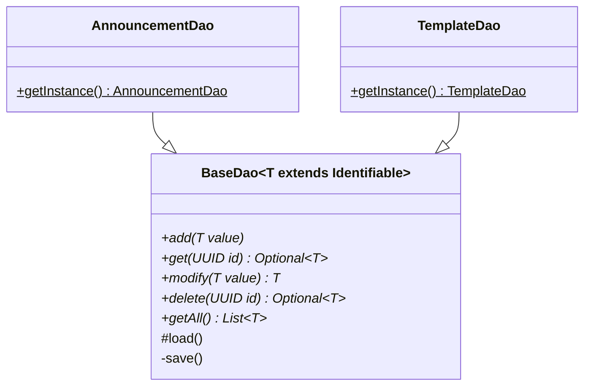
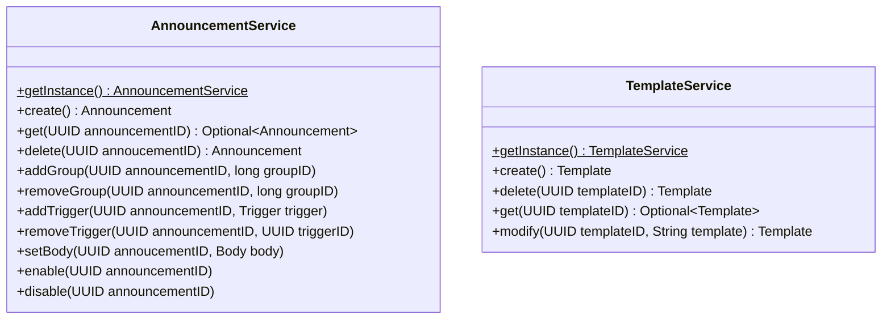

# 类图
## 实体类

```mermaid
classDiagram
class Body {
    <<interface>>    
    +getBodyString() String
}
class PlainBody {
    +String content
}
PlainBody --|> Body
class Template {
    +UUID uuid
    +String template
}
class TemplateBody {
    +Template template
    +Map~String, String~ var
}
Template --o TemplateBody
TemplateBody --|> Body
class Trigger {
    +UUID uuid
    +String cron
}
class Announcement {
    +UUID uuid
    +List~Long~ groups
    +Body body
    +boolean enabled
    +List~Trigger~ triggers
}
Trigger --* Announcement
Body --* Announcement
```

## Dao

```mermaid
classDiagram
class BaseDao~T extends Identifiable~ {
    +add(T value)*
    +get(UUID id)* Optional~T~
    +modify(T value)* T
    +delete(UUID id)* Optional~T~
    +getAll()* List~T~
    #load()
    -save()
}
class AnnouncementDao {
    +getInstance()$ AnnouncementDao
}
AnnouncementDao --|> BaseDao
class TemplateDao {
    +getInstance()$ TemplateDao
}
TemplateDao --|> BaseDao
```

## Service

```mermaid
classDiagram
class AnnouncementService {
    +getInstance()$ AnnouncementService
    
    +create() Announcement
    +get(UUID announcementID) Optional~Announcement~
    +delete(UUID annoucementID) Announcement
    +addGroup(UUID announcementID, long groupID)
    +removeGroup(UUID announcementID, long groupID)
    +addTrigger(UUID announcementID, Trigger trigger)
    +removeTrigger(UUID announcementID, UUID triggerID)
    +setBody(UUID annoucementID, Body body)
    +enable(UUID announcementID)
    +disable(UUID announcementID)
}
class TemplateService {
    +getInstance()$ TemplateService
    
    +create() Template
    +delete(UUID templateID) Template
    +get(UUID templateID) Optional~Template~
    +modify(UUID templateID, String template) Template
}
```